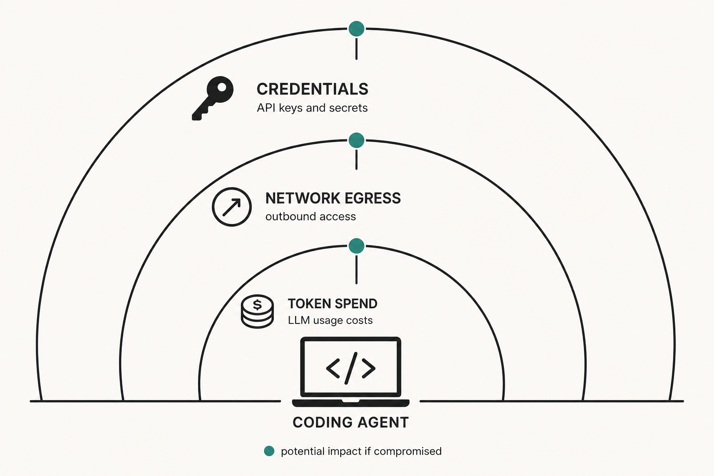
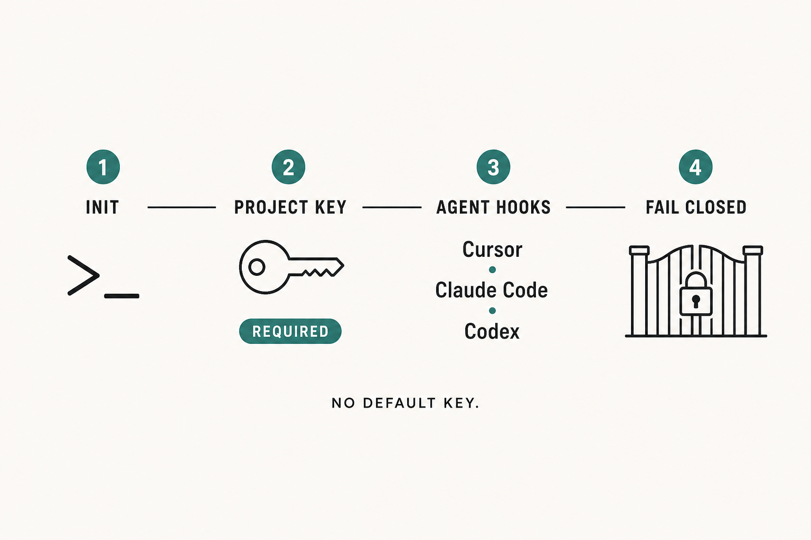

# Your coding agent has a blast radius. Most setups never measure it.

**Series:** JunoGuard field notes  
**Citation style:** Chicago Manual of Style, 17th ed. (notes and bibliography)  
**Primary keyword:** AI coding agent security

---



**Figure 1.** Blast radius of an unguarded coding agent: ambient credentials, network egress, and token spend become reachable if a bad install or runaway model loop succeeds. Illustration by JunoGuard.

An AI coding agent is a program with your credentials, your shell, and no institutional memory of your threat model. That is not a moral failing. It is the job description.

Cursor, Claude Code, Codex, and their peers are useful because they can install packages, edit files, call tools, and keep going until the task looks done. The same loop that finishes a feature also finishes a compromise. A dependency README can steer the model. A `postinstall` can read the environment. Stolen API keys can burn budget until someone notices the bill. None of that requires a clever exploit. It requires an install and a machine that trusts registries by default.

## Blast radius is not a metaphor

Blast radius is the set of things that become reachable if a bad action succeeds: credential names in scope, network egress, write access to the open repository, and the model budget that funds the next hundred retries. Most developer setups never compute that set until after the damage. Provider dashboards show spend after the requests. Software composition analysis tools often report CVEs after the package is already on disk. The agent, meanwhile, has already moved on to the next step.

JunoGuard exists to put a control plane between the agent and that radius. Not another chatty “AI security agent.” A deterministic gate.

## Two lanes, one question


**Figure 2.** Dual-lane control plane. Lane A gates package installs; Lane B gates LLM spend; both share allow / flag / block outcomes and a decision feed. Illustration by JunoGuard.

Every action answers the same question: should this proceed?

**Lane A — supply chain.** Before a package reaches disk, Juno asks for a malware verdict via Ossprey.[^1] No verdict means no install. Flagged packages do not proceed on unattended paths without an audited override. Registry-backed CycloneDX metadata captures the exact coordinate. Optional sandbox detonation can add behavioral evidence: local Docker can participate in the pre-verdict path; Modal runs on a cold path for isolation and evidence after the response.[^2] That distinction matters. Cold-path evidence does not rewrite an install that already happened; it enriches the record and can inform later blocks.

**Lane B — LLM spend.** Budgets, per-request caps, rate limits, and burst detection run on local pricing and accounting. There is no model call on the hot path for the decision itself. Hijacked agents often reveal themselves as abnormal token burn; treating that as telemetry is more honest than calling it a billing nicety. Adjacent products such as LiteLLM expose virtual keys and spend caps for model gateways; JunoGuard applies that class of control beside install policy for coding agents, not instead of it.[^3]

Both lanes share policy, incidents, and a kill switch operated by an accountable operator. The console decision feed is meant to show *why* something was allowed, flagged, or blocked—including blast-radius scope the client declared (credential *names* and capability flags, not secret values), SBOM evidence, and sandbox observations when present.

## Why “agent security” and “supply chain” split teams

If you only buy CVE scanning, you miss novel malware with no advisory yet. If you only buy an LLM gateway with virtual keys, you still let the agent `npm install` whatever a poisoned instruction requested. If you only buy an MCP traffic gateway, you may redact tool arguments while the shell still runs an ungated package manager.[^4]

Those products are real and often necessary. The gap is the coding-agent interrupt: the moment between “the model decided to install” and “code executed with your ambient authority.”

That gap has gotten sharper as attackers aimed at AI tooling itself. Public research on Model Context Protocol (MCP) tool poisoning shows how malicious instructions hide in tool metadata that models trust more readily than users see.[^5] Vendor advisories around MCP configuration swaps show that “approved yesterday” is not the same as “safe today.”[^6] Campaign reporting on npm worms and on malware that plants persistence into assistant configuration paths treats the coding assistant as both target and carrier.[^7] You do not need a new category name to understand the pattern: the agent’s trust surface is now part of the software supply chain. Classic incidents such as the 2018 `event-stream` compromise already showed how install-time trust can be abused without a conventional software vulnerability.[^8]

## What a refusal should look like


**Figure 3.** Agent-readable refusal: verdict, reason, and blast radius returned as a normal tool result so the model can self-correct instead of retrying a thrown error. Illustration by JunoGuard.

Blocking is table stakes. The useful part is making the refusal legible to the agent so it self-corrects instead of thrashing.

In mock mode you can see the shape without a gateway:

```bash
JUNO_MOCK=1 npx @heysalad/junoguard scan @ossprey/test-package
```

A live block is not a thrown tool error. Errors invite retries. A structured refusal with verdict, reason, and blast radius invites a different dependency. Allows stay quiet. Flags require a named override when the install is unattended. Scanner outages refuse; they do not silently become allows.

Clients require `JUNO_PROJECT_KEY` and fail closed without it. There is no default key shipped in the box. Juno’s own MCP tools are hash-pinned in `tools.lock.json` so a silent change to a tool description is a silent change to agent behavior—and the server refuses to start on mismatch. That practice follows the same integrity instinct researchers recommend when tool descriptions become an instruction channel.[^5]

## Honest limits (read these before you trust us)

MCP tool exposure is **advisory**: it works when the agent calls the tool. It is not a kernel boundary. Closing more of the gap means using the CLI forwarders (`juno npm|pnpm|yarn|pip …`), optional PATH wrap (`juno wrap on`), and the Cursor / Claude Code shell hooks that `init` can write. Absolute paths to the real package manager still bypass the wrap. JunoGuard does not claim poetry or uv gating. It does not claim anomaly-detection machine learning. Modal cold-path detonation is evidence infrastructure, not a time machine.

If a vendor cannot say those sentences out loud, they are selling comfort, not control.

## The job, stated plainly

Keep the agent productive without risking credentials, runaway spend, or an unrecoverable afternoon.

That is a founder and staff-engineer problem, not a quarterly AppSec slide. You want the model to keep shipping. You want a single place to suspend a project when something looks wrong. You want the feed that explains what would have happened if the block had been an allow.

## Start here



**Figure 4.** Install path: `init`, required project key, agent hooks, fail closed. Illustration by JunoGuard.

Read the product and console at [junoguard.com](https://junoguard.com).[^9]

Wire the client into the agents on your machine:

```bash
npx @heysalad/junoguard init
```

Use `JUNO_MOCK=1` when you want the refusal UX without credentials. For live policy you will need a gateway and a project key you chose—not one we embedded for you.[^10]

The blast radius was always there. The new part is measuring it before the afternoon is gone.

---

## Notes

[^1]: Ossprey Security, “Malicious Code Detection for Open Source,” Ossprey, accessed August 3, 2026, https://www.ossprey.com/.

[^2]: Modal Labs, “Sandboxes,” Modal Docs, accessed August 3, 2026, https://modal.com/docs/guide/sandboxes; Modal Labs, “Networking and Security,” Modal Docs, accessed August 3, 2026, https://modal.com/docs/guide/sandbox-networking.

[^3]: BerriAI, “Virtual Keys,” LiteLLM Docs, accessed August 3, 2026, https://docs.litellm.ai/docs/proxy/virtual_keys.

[^4]: MCP Manager, “Runtime Protections,” MCP Manager Docs, accessed August 3, 2026, https://docs.mcpmanager.ai/security/runtime-protections; Socket, “Socket vs Snyk,” Socket.dev, accessed August 3, 2026, https://socket.dev/compare/socket-vs-snyk.

[^5]: Luca Beurer-Kellner and Marc Fischer, “MCP Security Notification: Tool Poisoning Attacks,” Invariant Labs, April 2025, https://invariantlabs.ai/blog/mcp-security-notification-tool-poisoning-attacks. See also Zhihao Jia et al., “MCPTox: A Benchmark for Tool Poisoning Attack on Real-World MCP Servers,” arXiv, August 2025, https://arxiv.org/abs/2508.14925.

[^6]: National Institute of Standards and Technology, “CVE-2025-54136 Detail,” National Vulnerability Database, August 1, 2025, https://nvd.nist.gov/vuln/detail/CVE-2025-54136; Cursor, “MCPoison: Persistent Code Execution via Trusted MCP Configuration Modification,” GitHub Security Advisory GHSA-24mc-g4xr-4395, 2025, https://github.com/cursor/cursor/security/advisories/GHSA-24mc-g4xr-4395.

[^7]: Cybersecurity and Infrastructure Security Agency, “Widespread Supply Chain Compromise Impacting npm Ecosystem,” CISA Alert, September 23, 2025, https://www.cisa.gov/news-events/alerts/2025/09/23/widespread-supply-chain-compromise-impacting-npm-ecosystem; Palo Alto Networks Unit 42, “npm Supply Chain Attack,” Unit 42, 2025, https://unit42.paloaltonetworks.com/npm-supply-chain-attack/; Microsoft Security, “Shai-Hulud 2.0: Guidance for Detecting, Investigating, and Defending against the Supply Chain Attack,” December 9, 2025, https://www.microsoft.com/en-us/security/blog/2025/12/09/shai-hulud-2-0-guidance-for-detecting-investigating-and-defending-against-the-supply-chain-attack/; Cloud Security Alliance, “Miasma and IronWorm: AI Coding Supply Chain,” CSA Labs Research Note, June 2026, https://labs.cloudsecurityalliance.org/research/csa-research-note-miasma-ironworm-ai-coding-supply-chain-202/; Cloud Security Alliance, “TrapDoor: Multi-Ecosystem Supply Chain AI Targeting,” CSA Labs Research Note, 2026, https://labs.cloudsecurityalliance.org/research/csa-research-note-trapdoor-multi-ecosystem-supply-chain-ai-t/.

[^8]: npm, Inc., “Details about the event-stream Incident,” npm Blog, November 26, 2018, archived at https://web.archive.org/web/20191031163820/https:/blog.npmjs.org/post/180565383195/details-about-the-event-stream-incident.

[^9]: HeySalad, “JunoGuard,” accessed August 3, 2026, https://junoguard.com.

[^10]: HeySalad, “@heysalad/junoguard,” npm, August 1, 2026, https://www.npmjs.com/package/@heysalad/junoguard.

---

## Bibliography

Beurer-Kellner, Luca, and Marc Fischer. “MCP Security Notification: Tool Poisoning Attacks.” Invariant Labs, April 2025. https://invariantlabs.ai/blog/mcp-security-notification-tool-poisoning-attacks.

BerriAI. “Virtual Keys.” LiteLLM Docs. Accessed August 3, 2026. https://docs.litellm.ai/docs/proxy/virtual_keys.

Cloud Security Alliance. “Miasma and IronWorm: AI Coding Supply Chain.” CSA Labs Research Note, June 2026. https://labs.cloudsecurityalliance.org/research/csa-research-note-miasma-ironworm-ai-coding-supply-chain-202/.

———. “TrapDoor: Multi-Ecosystem Supply Chain AI Targeting.” CSA Labs Research Note, 2026. https://labs.cloudsecurityalliance.org/research/csa-research-note-trapdoor-multi-ecosystem-supply-chain-ai-t/.

Cursor. “MCPoison: Persistent Code Execution via Trusted MCP Configuration Modification.” GitHub Security Advisory GHSA-24mc-g4xr-4395, 2025. https://github.com/cursor/cursor/security/advisories/GHSA-24mc-g4xr-4395.

Cybersecurity and Infrastructure Security Agency. “Widespread Supply Chain Compromise Impacting npm Ecosystem.” CISA Alert, September 23, 2025. https://www.cisa.gov/news-events/alerts/2025/09/23/widespread-supply-chain-compromise-impacting-npm-ecosystem.

HeySalad. “@heysalad/junoguard.” npm, August 1, 2026. https://www.npmjs.com/package/@heysalad/junoguard.

———. “JunoGuard.” Accessed August 3, 2026. https://junoguard.com.

Jia, Zhihao, et al. “MCPTox: A Benchmark for Tool Poisoning Attack on Real-World MCP Servers.” arXiv, August 2025. https://arxiv.org/abs/2508.14925.

MCP Manager. “Runtime Protections.” MCP Manager Docs. Accessed August 3, 2026. https://docs.mcpmanager.ai/security/runtime-protections.

Microsoft Security. “Shai-Hulud 2.0: Guidance for Detecting, Investigating, and Defending against the Supply Chain Attack.” December 9, 2025. https://www.microsoft.com/en-us/security/blog/2025/12/09/shai-hulud-2-0-guidance-for-detecting-investigating-and-defending-against-the-supply-chain-attack/.

Modal Labs. “Networking and Security.” Modal Docs. Accessed August 3, 2026. https://modal.com/docs/guide/sandbox-networking.

———. “Sandboxes.” Modal Docs. Accessed August 3, 2026. https://modal.com/docs/guide/sandboxes.

National Institute of Standards and Technology. “CVE-2025-54136 Detail.” National Vulnerability Database, August 1, 2025. https://nvd.nist.gov/vuln/detail/CVE-2025-54136.

npm, Inc. “Details about the event-stream Incident.” npm Blog, November 26, 2018. Archived at https://web.archive.org/web/20191031163820/https:/blog.npmjs.org/post/180565383195/details-about-the-event-stream-incident.

Ossprey Security. “Malicious Code Detection for Open Source.” Ossprey. Accessed August 3, 2026. https://www.ossprey.com/.

Palo Alto Networks Unit 42. “npm Supply Chain Attack.” Unit 42, 2025. https://unit42.paloaltonetworks.com/npm-supply-chain-attack/.

Socket. “Socket vs Snyk.” Socket.dev. Accessed August 3, 2026. https://socket.dev/compare/socket-vs-snyk.
