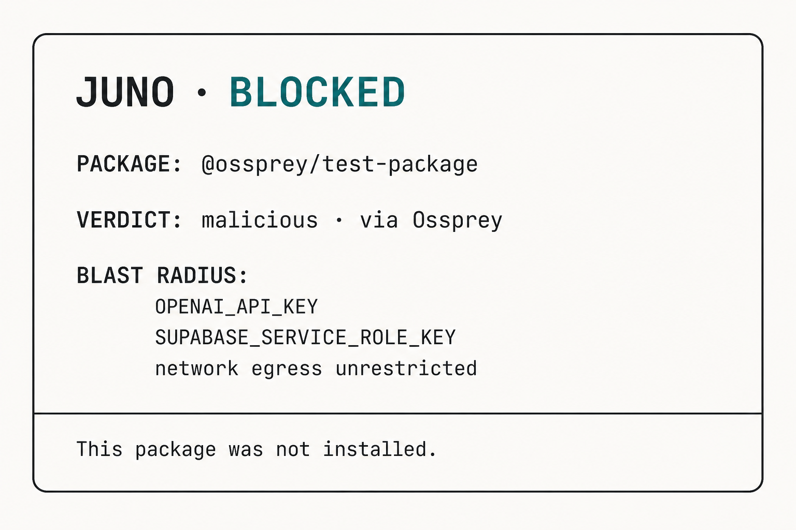

# Demo story: blocking `@ossprey/test-package` and reading the blast radius, SBOM, and sandbox evidence.

**Series:** JunoGuard field notes  
**Citation style:** Chicago Manual of Style, 17th ed. (notes and bibliography)  
**Primary keyword:** JunoGuard demo

---



**Figure 1.** A block is not a thrown error. It is a structured refusal the agent can read and act on. Illustration by JunoGuard.

This is a walkthrough, not a slide deck. You can run every command below on your laptop without a gateway, without a project key, and without sending a package anywhere near disk. The fixture is `@ossprey/test-package` — a deliberate set piece that Ossprey marks malicious so JunoGuard can show what a real refusal looks like end to end.

## Step zero: mock mode

JunoGuard ships offline fixtures behind `JUNO_MOCK=1`. No network. No `JUNO_PROJECT_KEY`. The clients behave exactly as they would against a live gateway — same decision vocabulary, same blast-radius fields, same refusal shape.[^1]

That matters for demos and for CI: if the gateway is down, the agent should refuse clearly, not silently proceed.

Run the scan:

```bash
JUNO_MOCK=1 npx @heysalad/junoguard scan @ossprey/test-package
```

You should see a **BLOCK** outcome, not a stack trace.

## What the refusal contains

A live block — and the mock block — returns structured fields the agent can parse:

- **Decision:** `block`
- **Reason:** Ossprey verdict: malicious. The package was not installed.
- **Verdict findings:** obfuscated postinstall script, outbound POST on install, reads process environment at install time
- **Blast radius:** credential names in scope (`OPENAI_API_KEY`, `SUPABASE_SERVICE_ROLE_KEY`, `AWS_PROFILE=prod`), network egress, write access to the open repository — names and capability flags, never secret values


**Figure 2.** Lane A evaluated the install before disk. Lane B is idle for this action. Illustration by JunoGuard.

This is the product argument in one screen: the model asked to install something; Juno answered **no** with evidence; the agent can choose a different dependency instead of retrying the same coordinate until something breaks.

Compare that to a thrown tool error. Errors invite retries. Structured refusals invite correction.

## SBOM: the exact coordinate

Lane A does not guess from a package name string alone. Registry-backed CycloneDX metadata captures the exact coordinate — ecosystem, name, version resolution — so the decision feed and incident record reference what was *requested*, not what the model paraphrased in chat.[^2]

In a live deployment, that SBOM evidence attaches to the action ID in the console feed. In mock mode, the fixture still demonstrates the field layout so integrators know what to expect when they wire MCP or shell forwarders.

If you only ever see “blocked” with no coordinate, you cannot audit later. JunoGuard treats the SBOM as part of the refusal record, not an optional appendix.

## Sandbox evidence: cold path, honest timing

Optional sandbox detonation adds behavioral evidence. Local Docker can participate in the pre-verdict path when configured; Modal runs on a **cold path** for isolation and evidence after the response.[^3]

That distinction matters for how you read the demo:

- For a **blocked** package like `@ossprey/test-package`, sandbox output is supporting evidence — the blast radius stopped at the gate; detonation confirms what the install script would have attempted.
- For an **allowed** package, cold-path detonation enriches the record after the decision. It does not rewrite an install that already happened. Modal is evidence infrastructure, not a time machine.

Do not narrate cold-path sandbox as “we would have blocked it if we had waited.” JunoGuard blocks on Ossprey verdict and policy before unattended installs proceed. Sandbox adds depth to the feed; it does not retroactively change the decision.

## Flagged vs blocked

The mock fixture includes a second coordinate for contrast:

```bash
JUNO_MOCK=1 npx @heysalad/junoguard scan @ossprey/suspicious-package
```

That returns **FLAG** — no published provenance, very recent first release, name one character from a popular package. Flagged packages do not proceed on **unattended** paths without an audited override. The agent sees the same blast-radius scope and must not treat a flag as a silent allow.

Allows stay quiet. Blocks and flags are loud on purpose.

## Through the MCP tool

When the agent calls `guard_install` instead of the CLI, the same payload renders as an agent-readable panel — title `JUNO · BLOCKED`, verdict lines, blast-radius section. MCP exposure is **advisory**: it works when the agent calls the tool. Closing more of the gap means forwarders (`juno npm|pnpm|yarn|pip …`), optional PATH wrap (`juno wrap on`), and shell hooks from `init`. Absolute paths to the real package manager still bypass the wrap.[^4]

Research on MCP tool poisoning shows why tool metadata itself is a trust surface — a separate problem from install gating, but adjacent.[^5] This demo is Lane A only: did the package reach disk?

## Scanner outage: fail closed

If Ossprey is unreachable, JunoGuard refuses. No verdict means no install. Scanner outages do not silently become allows — that would turn infrastructure failure into a proceedable “install with caution” lie. The mock fixture does not simulate outage by default; live operators should expect a block with retry guidance when the scanner is down.[^6]

## Wire it into the agent

Seeing the CLI refusal is step one. Step two is putting the same gate on the agent’s path:

```bash
npx @heysalad/junoguard init --mock
```

That writes MCP config and shell hooks for Cursor, Claude Code, and Codex with `JUNO_MOCK=1` — no default project key. For live policy, export `JUNO_PROJECT_KEY` and re-run without `--mock`. Clients fail closed without a key you chose.[^1]

Read the console and product docs at [junoguard.com](https://junoguard.com).[^7]

## What this demo proves

It proves the interrupt works: verdict, reason, blast radius, SBOM coordinate, optional sandbox enrichment — returned as a normal tool result so the model self-corrects. It does not prove JunoGuard sanitizes the entire npm ecosystem, blocks poetry/uv, or stops an agent that never calls the tool. Those limits are real and documented elsewhere in this series.

Run the command. Read the panel. That is the product.

---

## Notes

[^1]: HeySalad, “@heysalad/junoguard,” npm, August 1, 2026, https://www.npmjs.com/package/@heysalad/junoguard.

[^2]: Ossprey Security, “Malicious Code Detection for Open Source,” Ossprey, accessed August 3, 2026, https://www.ossprey.com/.

[^3]: Modal Labs, “Sandboxes,” Modal Docs, accessed August 3, 2026, https://modal.com/docs/guide/sandboxes; Modal Labs, “Networking and Security,” Modal Docs, accessed August 3, 2026, https://modal.com/docs/guide/sandbox-networking.

[^4]: MCP Manager, “Runtime Protections,” MCP Manager Docs, accessed August 3, 2026, https://docs.mcpmanager.ai/security/runtime-protections.

[^5]: Luca Beurer-Kellner and Marc Fischer, “MCP Security Notification: Tool Poisoning Attacks,” Invariant Labs, April 2025, https://invariantlabs.ai/blog/mcp-security-notification-tool-poisoning-attacks.

[^6]: HeySalad, “JunoGuard,” accessed August 3, 2026, https://junoguard.com.

[^7]: HeySalad, “JunoGuard.”

---

## Bibliography

Beurer-Kellner, Luca, and Marc Fischer. “MCP Security Notification: Tool Poisoning Attacks.” Invariant Labs, April 2025. https://invariantlabs.ai/blog/mcp-security-notification-tool-poisoning-attacks.

HeySalad. “@heysalad/junoguard.” npm, August 1, 2026. https://www.npmjs.com/package/@heysalad/junoguard.

———. “JunoGuard.” Accessed August 3, 2026. https://junoguard.com.

MCP Manager. “Runtime Protections.” MCP Manager Docs. Accessed August 3, 2026. https://docs.mcpmanager.ai/security/runtime-protections.

Modal Labs. “Networking and Security.” Modal Docs. Accessed August 3, 2026. https://modal.com/docs/guide/sandbox-networking.

———. “Sandboxes.” Modal Docs. Accessed August 3, 2026. https://modal.com/docs/guide/sandboxes.

Ossprey Security. “Malicious Code Detection for Open Source.” Ossprey. Accessed August 3, 2026. https://www.ossprey.com/.
