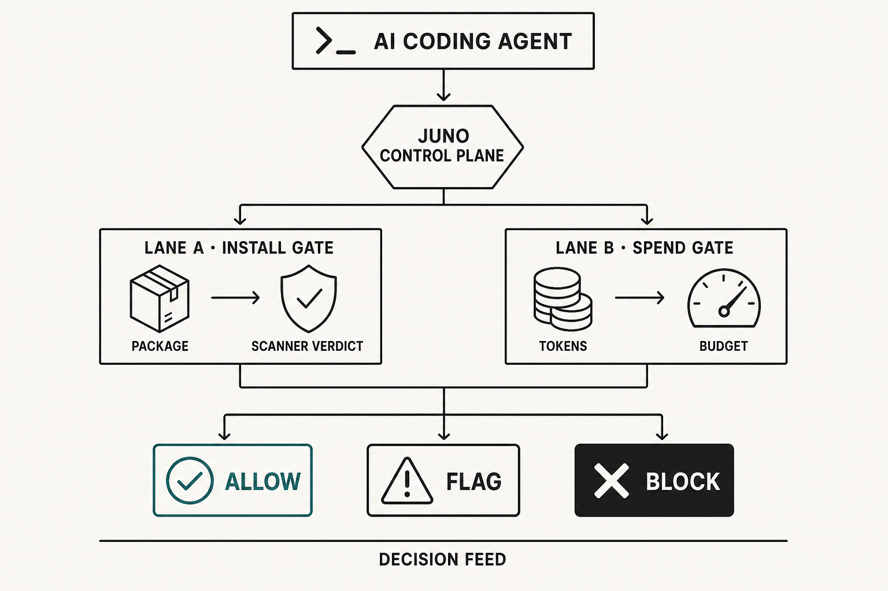

# Honest limits: MCP is advisory, PATH wrap is bypassable, Modal cold-path doesn’t rewrite the past.

**Series:** JunoGuard field notes  
**Citation style:** Chicago Manual of Style, 17th ed. (notes and bibliography)  
**Primary keyword:** JunoGuard limits

---



**Figure 1.** Solid lines are what JunoGuard gates. Dashed lines are bypass paths you must plan for. Illustration by JunoGuard.

Trust requires saying what you are not. This post is the list we expect you to read before you trust us — not buried in a FAQ, stated plainly up front.

If a vendor cannot say these sentences out loud, they are selling comfort, not control.

## MCP is advisory, not a kernel boundary

JunoGuard exposes MCP tools — `guard_install`, `guard_llm`, `guard_status` — so agents can scan before install and proxy model calls under policy. That works **when the agent calls the tool**.

It is not a kernel boundary. An agent — or a user — can still open a terminal and run `/usr/local/bin/npm install` without ever touching Juno. An MCP gateway that redacts arguments does not stop shell execution the model triggers elsewhere.[^1]

Closing more of the gap means layering controls:

- **CLI forwarders:** `juno npm|pnpm|yarn|pip …` evaluate Lane A or B before delegating to the real binary.
- **Shell hooks:** `init` can write Cursor and Claude Code hooks that route package-manager commands through the forwarder.
- **PATH wrap:** `juno wrap on` installs project-local shims in `.junoguard/bin` so bare `npm install` hits Juno when that directory precedes the real binary on PATH.

None of that is invisible enforcement. It is defense in depth with explicit bypass paths you should document in your runbook.

## PATH wrap is bypassable

`juno wrap on` is opt-in and local. It helps when agents invoke `npm` without a full path. It does **not** help when something invokes `/opt/homebrew/bin/npm` or the system Node shim directly. Absolute paths bypass the wrap.

We say that in product docs because pretending otherwise would be dishonest. Your compensating controls are hooks, MCP discipline, and operator policy — not a belief that PATH magic is total.

## Forwarders: npm, pnpm, yarn, pip — not poetry or uv

JunoGuard ships guarded forwarders for **npm, pnpm, yarn, and pip** in the TypeScript and Python CLIs. Those are the package managers coding agents invoke most often in the workflows we target.

We do **not** claim poetry or uv gating. If your stack standardizes on those tools, you need a different interrupt or accept that Lane A does not cover that path yet. Saying “we secure supply chain” without that caveat would be worse than saying nothing.

## No anomaly-detection machine learning

Lane B applies budgets, per-request caps, rate limits, and burst detection using **local pricing and accounting**. Rules are deterministic. There is no ML model guessing whether this prompt “looks weird” on the hot path.

We will not market “AI-powered anomaly detection” we do not ship. Burst detection is threshold logic on spend telemetry — useful, honest, and inspectable — not a black box.

## Modal cold-path is evidence, not a time machine

Optional sandbox detonation adds behavioral evidence. Local Docker can participate in the pre-verdict path when configured. Modal runs on a **cold path** for isolation and enrichment **after** the response returns to the client.[^2]

That timing distinction matters:

- For a **block**, cold-path sandbox output supports the verdict — what the install script would have attempted — after the gate already refused.
- For an **allow**, cold-path detonation enriches the incident record. It does **not** rewrite an install that already happened.

Narrating Modal as “we would have blocked it if we had waited” misstates the product. JunoGuard blocks on Ossprey verdict and policy before unattended installs proceed. Sandbox adds depth; it does not retroactively change the decision.

## Scanner outage: refuse, do not silently allow

If the supply-chain scanner is unavailable, there is no verdict. No verdict means no install. Infrastructure failure must not grade as “proceed with caution.” JunoGuard refuses and tells the agent to retry when the scanner is reachable or seek operator review.[^3]

That is a limit too: during an outage, unattended installs stop. That is preferable to silently allowing packages because failing open felt faster.

## What JunoGuard still does well within those limits

Within the paths above, every action answers one question: should this proceed?

**Lane A** asks Ossprey for a malware verdict before disk. Flagged packages do not proceed unattended without override. SBOM metadata captures the coordinate.[^4]

**Lane B** gates spend with the same allow / flag / block vocabulary. No LLM on the hot path for the decision itself.

Refusals are structured for the agent — verdict, reason, blast radius — not thrown errors that invite retries. Clients fail closed without `JUNO_PROJECT_KEY`. Mock mode (`JUNO_MOCK=1`) proves the UX without credentials. Juno’s own MCP tools are hash-pinned in `tools.lock.json` so a silent change to a tool description cannot start the server unnoticed.[^5]

Research on MCP tool poisoning shows why tool metadata is an instruction channel models trust.[^5] Hash-pinning our surface follows the same integrity instinct; it does not sanitize third-party MCP servers you also run.

## How to plan around the limits

| Gap | Compensating control |
|-----|----------------------|
| Agent skips MCP | Shell hooks + forwarders + PATH wrap |
| Absolute-path npm | Operator policy; CI uses forwarders |
| poetry / uv | Not covered — explicit acceptance or custom wrapper |
| MCP-only spend guard | Lane B forwarder for model calls |
| Post-hoc sandbox | Treat as evidence in feed, not as prevention |

Honest limits tell you where to spend engineering time instead of where to stop asking questions.

## Start here

Read the product at [junoguard.com](https://junoguard.com).[^6]

Wire agents fail-closed:

```bash
npx @heysalad/junoguard init
```

Use `--mock` to explore refusals without keys. Add `juno wrap on` when you want PATH help — knowing it is not total.

We would rather lose a sale than imply a boundary we do not enforce.

---

## Notes

[^1]: MCP Manager, “Runtime Protections,” MCP Manager Docs, accessed August 3, 2026, https://docs.mcpmanager.ai/security/runtime-protections.

[^2]: Modal Labs, “Sandboxes,” Modal Docs, accessed August 3, 2026, https://modal.com/docs/guide/sandboxes.

[^3]: HeySalad, “JunoGuard,” accessed August 3, 2026, https://junoguard.com.

[^4]: Ossprey Security, “Malicious Code Detection for Open Source,” Ossprey, accessed August 3, 2026, https://www.ossprey.com/.

[^5]: Luca Beurer-Kellner and Marc Fischer, “MCP Security Notification: Tool Poisoning Attacks,” Invariant Labs, April 2025, https://invariantlabs.ai/blog/mcp-security-notification-tool-poisoning-attacks.

[^6]: HeySalad, “JunoGuard.”

---

## Bibliography

Beurer-Kellner, Luca, and Marc Fischer. “MCP Security Notification: Tool Poisoning Attacks.” Invariant Labs, April 2025. https://invariantlabs.ai/blog/mcp-security-notification-tool-poisoning-attacks.

HeySalad. “JunoGuard.” Accessed August 3, 2026. https://junoguard.com.

MCP Manager. “Runtime Protections.” MCP Manager Docs. Accessed August 3, 2026. https://docs.mcpmanager.ai/security/runtime-protections.

Modal Labs. “Sandboxes.” Modal Docs. Accessed August 3, 2026. https://modal.com/docs/guide/sandboxes.

Ossprey Security. “Malicious Code Detection for Open Source.” Ossprey. Accessed August 3, 2026. https://www.ossprey.com/.
